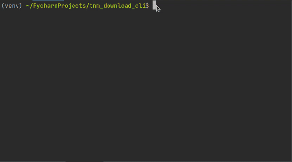

# tnm_download_cli
A CLI for downloading data from the USGS National Map 

## Installation
1.  clone this repo
2.  run `pip install -r requirements.txt`
3.  run `python tnm_download.py -h`

## Usage

    usage: tnm_download.py [-h] -e EXTENT -o OUTPUT_DIR [-t THREADS]
    
    USGS National Map Download CLI
    
    required arguments:   -e EXTENT, --extent EXTENT
                            WGS84 Extent (xmin,ymin,xmax,ymax) of area to download data   -o OUTPUT_DIR, --output_dir OUTPUT_DIR
                            Directory where data will be downloaded to
    
    optional arguments:   -h, --help            show this help message and exit   -t THREADS, --threads THREADS
                            The number of threads used to download data

The CLI makes use of the inquirer package to make the selection of products much more user friendly from the command line.  Use the up/down arrows to navigate through the list of available products (which will vary by area), and use the space bar to select/de-select products.

